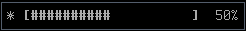

# AWM Kmodules

**AWM Kmodules** is a group of small modules for [AwesomeWM 4](https://awesomewm.org/).
These modules can be loaded individually.

## Getting Started

Just clone it in your awesome configuration dir (usually ~/.config/awesome/) and
require it in your rc.lua with `require("awm_kmodules")`  
Each module can be loaded individually, the return value when loading the module
is the return value of the `require(module)` function:

```
local my_modules = require("awm_kmodules")
my_modules("awm_brightness") -- Brightness
my_modules("awm_kborderless") -- Remove borders
local focus_gradient_border_fun = my_modules("awm_focus_gradient_border")
```

For an explaination of the different modules, continue reading.

# AWM Brightness

**AWM Brightness** is a really simple module to handle brightness with [xbacklight](https://www.x.org/archive/X11R7.5/doc/man/man1/xbacklight.1.html),
reporting the value with a highly customizable notification.

The default values for a notification like  
  
are:
```
local brightness = require("awm_brightness") -- If awm_brightness.lua is directly in the config dir
local brightness = require("awm_kmodules")("awm_brightness")

brightness.brightness_step = 5
brightness.notification_text = {
    head = '☼ <span weight="bold">[',
    symbol_active = "#",
    symbol_inactive = " ",
    tail = "]</span> "
}
brightness.notification_defaults = {
    timeout = 2,
    border_width = 1,
    ignore_suspend = true,
}

```

(This module automatically hooks to the XF86MonBrightness* keys)

# AWM DBusXrandr

**AWM DBusXrandr** is a module that provides a function to iterate over different
[xrandr](https://www.x.org/archive/X11R7.5/doc/man/man1/xrandr.1.html)
configurations and listens to dbus events to automatically enable and disable
screens upon connection.

It was largely inspired by [http://awesome.naquadah.org/wiki/Using_Multiple_Screens](http://awesome.naquadah.org/wiki/Using_Multiple_Screens)
(it builds the xrandr command and reports the selected setup in a similar way)

In order to achieve UDEV + DBUS integration, you need an udev rule like this:
```
$ cat /etc/udev/rules.d/95-monitor-hotplug.rules
KERNEL=="card[0-9]*", SUBSYSTEM=="drm", RUN+="/usr/bin/dbus-send --system --type=signal / org.custom.screen_change.screen_changed"
```

You can iterate over the configurations by calling the value returned
when requiring this module:
```
local xrandr_setup_iter = require("awm_dbusxrandr") -- If awm_dbusxrandr.lua is directly in the config dir
local xrandr_setup_iter = require("awm_kmodules")("awm_dbusxrandr")

xrandr_setup_iter()
```
(This module automatically hooks that call to the XF86Display key)

# AWM Focus Gradient Border

**AWM Focus Gradient Border** is a module that applies a gradient over time to the focused client border color.

You can see the module in action in this [video](awm_focus_gradient_border.example.mp4)

You can customize it with values provided to the function returned by the
require:
```
local focus_gradient_border_fun = require("awm_focus_gradient_border") -- If awm_focus_gradient_border.lua is directly in the config dir
local focus_gradient_border_fun = require("awm_kmodules")("awm_focus_gradient_border")

```
```
-- OPTION 1:
-- Focus starts with color border_focus but fades into border_normal
-- Fading stays, but faster, when unfocused
focus_gradient_border_fun("focus", {
    origin_color = beautiful.border_focus,
    target_color = beautiful.border_normal
})
```
```
-- OPTION 2:
-- Focus show briefly in blue before turning to border_focus
focus_gradient_border_fun("focus", {
    origin_color = "#109FFF",
    target_color = beautiful.border_focus,
    elapse_time = .6
})
-- When a client loses focus, change to border_normal from its current border color
focus_gradient_border_fun("unfocus", {target_color = beautiful.border_normal})
```
This plugin allows callbacks instead of target_color, the callback will be
called with the client as argument.

# AWM KBorderless

**AWM KBorderless** is a simple module that removes borders from clients when they are redundant (for example, when maximized or
when that client is the only visible one)

You can provide callbacks to this module so it won't change anything
about a client if it returns true for on its manage signal

```
local my_modules = require("awm_kmodules")
my_modules("awm_kborderless")(function(c) return othermodule:is_othermodule_client(c) end)
```

# AWM Ti[t]leless

**AWM Ti[t]leless** is a really simple module that shows the title only on floating windows (and activates ontop).

You can provide callbacks to this module so it won't change anything
about a client if it returns true for on its manage signal

```
local my_modules = require("awm_kmodules")
my_modules("awm_titleless")(function(c) return othermodule:is_othermodule_client(c) end)
```

# AWM Simple Amixer Volume

**AWM Simple Amixer Volume** is a really simple widget to track the volume with
amixer. It hooks to global XF86 keys.
```
local my_modules = require("awm_kmodules")
local volume_widget = my_modules("awm_simple_amixer_volume")
```

# AWM Simple Pacman Widget

**AWM Simple Pacman Widget** is a really simple widget that stays hidden
checking whether there are updates or not, displaying a ! if there are updates
available. Custom commands could be provided.
```
local my_modules = require("awm_kmodules")
local pacman_update = my_modules("awm_simple_pacman_widget")()
local apt_update = my_modules("awm_simple_pacman_widget"){
   check = "bash -c 'apt list --upgradable 2>/dev/null | tail -n +2'",
   update = terminal .. " -e sudo apt upgrade"
}
```

# AWM Distributed Tags

**AWM Distributed Tags** is a simple module for AwesomeWM 4 to redistribute the
tags among the available screens and move them when new screens are added or removed.

```
local my_modules = require("awm_kmodules")
my_modules("awm_distributed_tags")
```

## Authors

* **Jose M Perez Ramos** - [Kuroneer](https://github.com/Kuroneer)

## License

This project is released under the GPLv3. Check [LICENSE](LICENSE) for more information.

